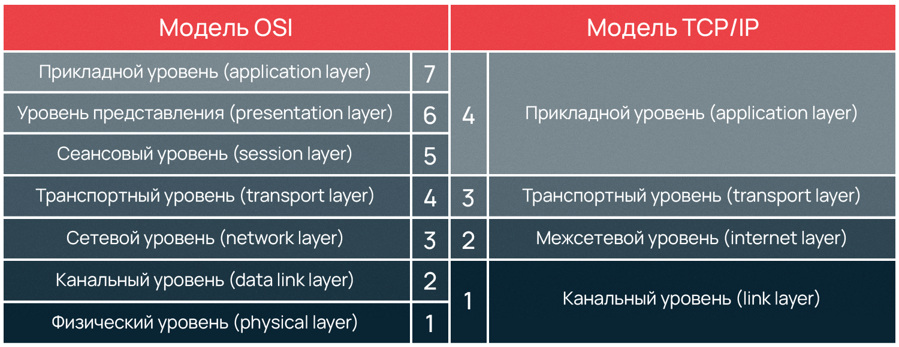
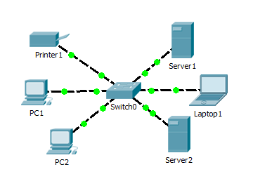
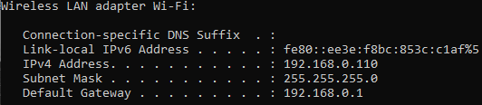
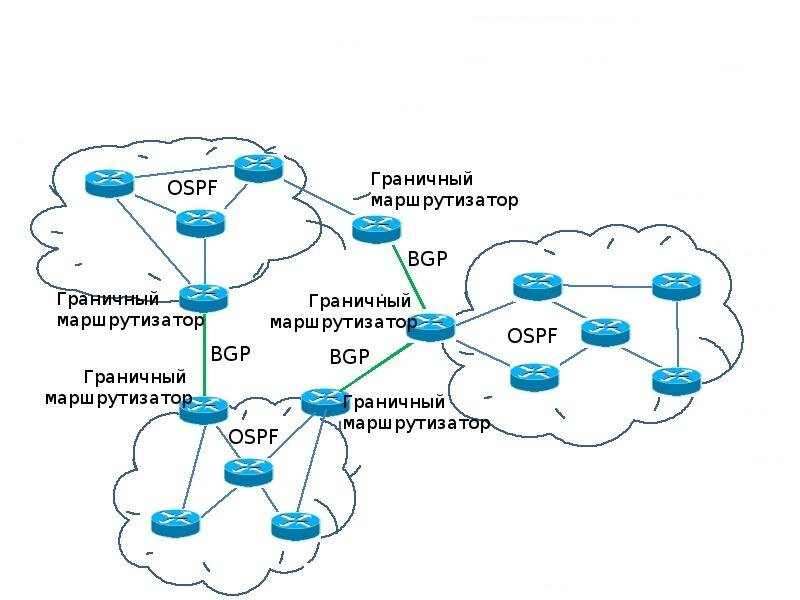

---
## Front matter
lang: ru-RU
title: Обзор стратегий маршрутизации и маршрутизаторов
subtitle: Операционные системы
author:
  - Перегудов А.В.
institute:
  - Российский университет дружбы народов, Москва, Россия
date: 21 апреля 2024

## i18n babel
babel-lang: russian
babel-otherlangs: english

## Fonts
mainfont: PT Serif
romanfont: PT Serif
sansfont: PT Sans
monofont: PT Mono
mainfontoptions: Ligatures=TeX
romanfontoptions: Ligatures=TeX
sansfontoptions: Ligatures=TeX,Scale=MatchLowercase
monofontoptions: Scale=MatchLowercase,Scale=0.9

## Formatting pdf
toc: false
toc-title: Содержание
slide_level: 2
aspectratio: 169
section-titles: true
theme: metropolis
header-includes:
 - \metroset{progressbar=frametitle,sectionpage=progressbar,numbering=fraction}
 - '\makeatletter'
 - '\beamer@ignorenonframefalse'
 - '\makeatother'
---

## Преподователь

  * Дмитрий Сергеевич Кулябов
  * Учёная степень: Доктор физико-математических наук по специальности 05.13.18 «Математическое моделирование, численные методы и комплексы программ»
  * Учёное звание: Доцент по кафедре систем телекоммуникаций

## Информация о докладчике
  
  {width=20%}

  - Перегудов Александр Вадимович
  - Студент 2 курса группы НКАбд-04-23
  - Российский университет дружбы народов

## Вводная часть

  - Актуальность темы: В современном мире эффективное решение проблем с сетями является неопходимым, потому что информационному обществу необходима эффективная инфраструктура для передачи данных и работы с информацией. 

  - Объектом исследования являются сетевые технологии.
  - Предметом исследования стратегии маршрутизации и маршрутизаторы.

  - Научная новизна: Комплексный анализ теоретической базы существующих стратегий маршрутизации и работы сети в целом.

  - Практическая значимость работы: Практическая значимость работы состоит в том, что она предоставляет полезную информацию для специалистов в области сетевых технологий и системного администрирования. 

## Цели и задачи

Освоить теоритическую базу в области компьютерных сетей, и изучить основные решения проблем связанных с маршрутизацией.

## TCP/IP

TCP/IP — сетевая модель передачи данных, представленных в цифровом виде. Модель описывает способ передачи данных от источника информации к получателю. В модели предполагается прохождение информации через четыре уровня, каждый из которых протоколом передачи.

{width=70%}

## Сеть

## IP и MAC адреса

## Маршрутизация

{width=70%}

## RIP

RIP — так называемый протокол дистанционно-векторной маршрутизации, который оперирует транзитными участками (хоп, hop) в качестве метрики маршрутизации.

Максимальное количество транзитных участков, разрешенное в RIP — 15.

Каждый RIP-маршрутизатор по умолчанию вещает в сеть свою полную таблицу маршрутизации раз в 30 секунд.

## OSPF

Протокол динамической маршрутизации, основанный на технологии отслеживания состояния канала (link-state technology) и использующий для нахождения кратчайшего пути алгоритм Дейкстры.

## BGP

BGP (Border Gateway Protocol) — протокол динамической маршрутизации.
Относится к классу протоколов маршрутизации внешнего шлюза (EGP — Exterior Gateway Protocol).

На текущий момент является основным протоколом динамической маршрутизации в сети Интернет.

BGP поддерживает бесклассовую адресацию и использует суммирование маршрутов для уменьшения таблиц маршрутизации. С 1994 года действует четвёртая версия протокола, все предыдущие версии являются устаревшими.

BGP, наряду с DNS, является одним из главных механизмов, обеспечивающих функционирование Интернета.

